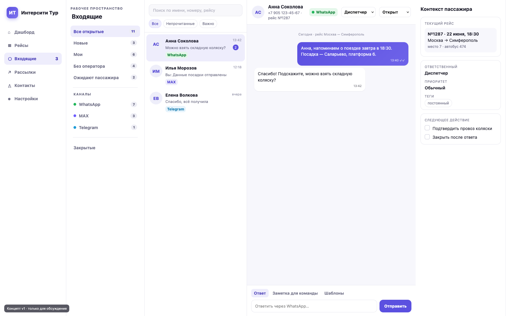

# Рекомендации Codex по развитию панели «Интерсити Тур»

Дата исследования: 21 июня 2026  
Статус: предложения для обсуждения — продуктовый код не изменён.

Полное исследование со всеми деталями: [docs/ux-audit/REPORT-2026-06-21.md](docs/ux-audit/REPORT-2026-06-21.md).

## Главный вывод

Полный редизайн панели не нужен. Текущая визуальная система выглядит цельно, современно и подходит продукту. Стоит сохранить:

- фирменный фиолетовый акцент;
- карточную структуру;
- четырёхшаговый мастер уведомлений;
- inline-редактирование ведомости;
- текущую server-rendered PHP-архитектуру;
- печатные формы.

Главный резерв улучшения находится не в цветах, а в операционной логике: входящие сообщения, структура рейсов, распределение работы между операторами и надёжность массовых отправок.

## Что сделать в первую очередь

### P0 — небольшие, но срочные исправления

1. Исправить мобильную sticky-панель «Отправить все группы»: сейчас она перекрывает форму и конкурирует с нижней навигацией.
2. Добавить общий обработчик ошибок API: сетевые ошибки, истёкшая сессия и не-JSON ответы не должны оставлять вечную «Загрузку…».
3. Возвращать и показывать канал каждого сообщения в чатах.
4. Развести действия «Очистить» и «Удалить ведомость»; удаление перенести в danger-меню.
5. В мобильной навигации заменить «Продажи» на более частый сценарий «Уведомления/Рассылки».
6. Убрать блок «Отправить на произвольный номер» со страницы рейсовых уведомлений — он дублирует свободную рассылку и чат.

### P1 — единый рабочий inbox

Превратить «Чаты» в рабочее место оператора:

- очереди «Новые», «Мои», «Без оператора», «Ожидаем пассажира», «Просроченные», «Закрытые»;
- ответственный оператор;
- статус разговора;
- приоритет;
- фильтры WhatsApp / MAX / Telegram / email;
- канал возле каждого сообщения;
- внутренние заметки;
- шаблоны ответа;
- отправка вложений;
- связь с рейсом и ведомостью;
- контекст пассажира справа;
- поиск по имени, номеру, рейсу и тексту сообщения.

Каналы не должны становиться отдельными изолированными вкладками. Основное разделение — по состоянию работы, а WhatsApp/MAX/Telegram используются как фильтры и маркеры. Иначе оператору придётся постоянно проверять несколько вкладок.

Концепт для обсуждения:

Исходный HTML концепта: [docs/ux-audit/concepts/inbox-v1.html](docs/ux-audit/concepts/inbox-v1.html).

### P1 — собрать работу вокруг рейса

В перспективе «Ведомость», «Пассажиры», «Уведомления», «Ответы» и «Документы» должны быть вкладками одной карточки рейса:

`Обзор · Пассажиры · Уведомления · Ответы · Документы`

Это уменьшит количество переходов и необходимость помнить, в каком разделе находится следующая операция.

Рекомендуемая основная навигация:

1. Сегодня.
2. Рейсы.
3. Входящие.
4. Рассылки.
5. Контакты.
6. Продажи и отчёты.
7. Администрирование.

## Что убрать или спрятать

- Ручную кнопку «Проверить каналы» заменить фоновой проверкой и отметкой времени актуальности.
- «Починить статусы» перенести в отдельную диагностику администратора.
- Удаление объектов убрать из ряда основных действий.
- В карточке контакта объединить входящие и исходящие в одну временную ленту.
- Внешние сервисы на дашборде сделать второстепенным сворачиваемым блоком.
- Не загружать сразу сотни input-полей в контактах и справочниках.

## Каким должен стать дашборд

Вместо преимущественно справочных цифр показывать кликабельные операционные задачи:

- непрочитанные входящие;
- разговоры без оператора;
- недоставленные сообщения;
- рейсы в ближайшие 24 часа;
- рейсы без автобуса или телефона водителя;
- группы, которые ещё не получили уведомления;
- свежие продажи, возвраты и аннуляции.

Все показатели должны использовать понятный одинаковый период. Сейчас «отправлено сегодня» сравнивается с ошибками за всё время.

## Надёжность рассылок

Для массовых отправок нужны:

- idempotency key, чтобы двойной клик или повтор запроса не создавал повторную кампанию;
- очередь исходящих сообщений;
- безопасные автоматические повторы;
- расписание отправки;
- черновики;
- дедупликация номеров;
- стоп-лист и исключения;
- preview первых получателей;
- отдельный журнал кампании;
- статистика sent/delivered/read/replied по каналу.

Сначала достаточно DB outbox worker. Redis и тяжёлая инфраструктура не обязательны на первом этапе.

## Предлагаемая модель чатов

Разговор нельзя идентифицировать только телефоном. Минимальный ключ:

`channel_account + external_chat_id + contact_id`

Рекомендуемые сущности:

- `channel_accounts` — подключённые аккаунты каналов;
- `conversations` — статус, ответственный, приоритет, канал, внешний chat id, контакт и рейс;
- `conversation_messages` — входящие/исходящие сообщения, media и delivery state;
- `conversation_events` — назначения, смена статуса, внутренние заметки;
- `outbox_jobs` — очередь, расписание, попытки и ошибки.

Миграция должна быть добавочной:

1. Создать новые таблицы.
2. Перенести историю из `messages` и `inbox`.
3. Временно писать в старую и новую модель одновременно.
4. Переключить чтение на новую модель.
5. После проверки отключить старый путь.

## Frontend и backend

Не рекомендую сейчас переписывать панель на React/Vue или целиком подключать Bootstrap/Tabler.

Полезный минимальный набор:

- [htmx](https://github.com/bigskysoftware/htmx) — фильтры, пагинация, частичные обновления;
- [Alpine.js](https://github.com/alpinejs/alpine) — drawer, dropdown и локальное состояние;
- [Chart.js](https://github.com/chartjs/Chart.js) — только для полезной динамики продаж/доставки;
- [PHPStan](https://github.com/phpstan/phpstan) — статический анализ;
- [Pest](https://github.com/pestphp/pest) или PHPUnit — тесты;
- [Symfony Messenger](https://github.com/symfony/messenger) — позже, если простого DB outbox станет недостаточно.

Важнее любой библиотеки: индексы БД, идемпотентность, cursor pagination, webhook fixtures и наблюдаемость ошибок.

## Claude Code

Рекомендуемые источники:

- [официальные Claude Code plugins](https://docs.anthropic.com/en/docs/claude-code/plugins);
- [официальные Claude Code skills](https://docs.anthropic.com/en/docs/claude-code/skills);
- [anthropics/skills](https://github.com/anthropics/skills);
- [obra/superpowers](https://github.com/obra/superpowers);
- [wshobson/agents](https://github.com/wshobson/agents).

Сторонние skills и hooks нужно читать перед установкой, фиксировать на конкретный commit и не давать им production-секреты.

Для панели полезно создать собственные project skills:

1. `panel-ui-review` — desktop/mobile screenshots, overflow, keyboard, contrast.
2. `panel-safe-deploy` — lint, tests, migrations, cache-bust, smoke-test, rollback.
3. `channel-webhook-contract` — fixtures Evolution/Green API и проверка дублей событий.
4. `manifest-regression` — обезличенные CSV разных форматов и ожидаемый результат парсинга.

## План внедрения

### Этап 0 — 1–2 дня

- mobile sticky;
- общий UI ошибок;
- канал в сообщениях;
- корректная мобильная навигация;
- кликабельные метрики;
- уборка дублирующих действий.

### Этап 1 — 4–7 дней

- основа новой модели conversations;
- статусы и ответственные;
- очереди и канальные фильтры;
- cursor pagination;
- оптимизация списка диалогов.

### Этап 2 — 4–7 дней

- контекст рейса;
- private notes;
- шаблоны и вложения;
- поиск;
- единая timeline контакта;
- фоновая проверка каналов.

### Этап 3 — 5–10 дней

- DB outbox;
- идемпотентность и retry policy;
- черновики и расписание;
- стоп-лист и дедупликация;
- аналитика кампаний.

Перед каждым изменением логики: desktop/mobile рендер → согласование → реализация → тестирование на обезличенных данных → production.

## Скриншоты аудита

Все экраны находятся в [docs/ux-audit/screens](docs/ux-audit/screens).

Особенно важные:

- [текущие уведомления](docs/ux-audit/screens/current/notifications.png);
- [мобильные уведомления](docs/ux-audit/screens/mobile/notifications.png);
- [текущие чаты](docs/ux-audit/screens/current/chats.png);
- [контакты](docs/ux-audit/screens/current/contacts.png);
- [концепт inbox](docs/ux-audit/concepts/inbox-v1.png).

